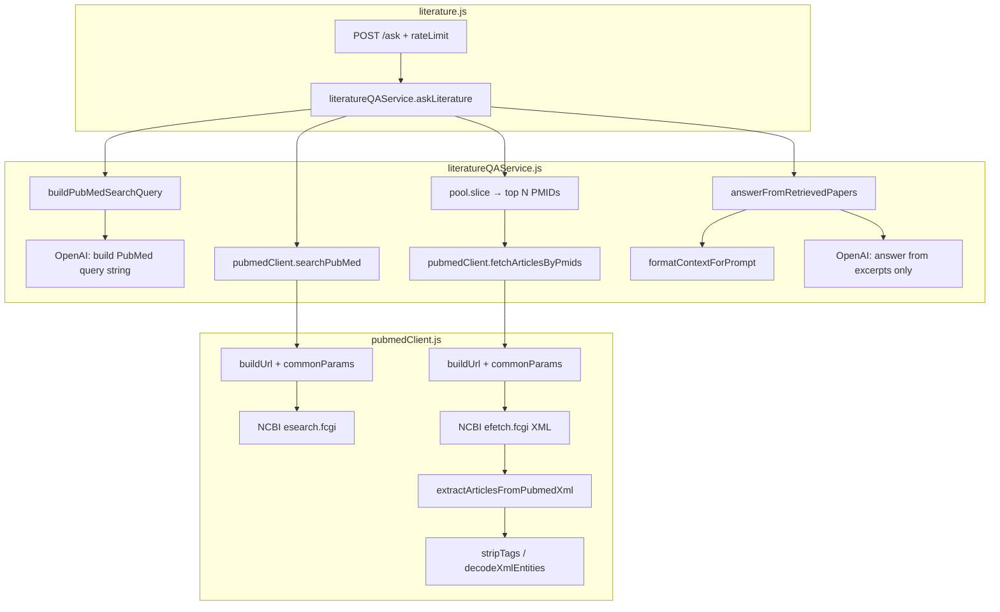

# PubMed literature Q&A: `literature.js` → `literatureQAService.js` → `pubmedClient.js`

## Layered architecture

| Layer | File | Responsibility |
|-------|------|----------------|
| HTTP | `src/routes/literature.js` | Validate body, rate-limit, call `askLiterature`, return JSON |
| Orchestration / RAG | `src/services/literatureQAService.js` | Build search query → PubMed search → fetch abstracts → grounded answer |
| Data source | `src/services/pubmedClient.js` | NCBI `esearch` / `efetch`, parse XML into article records |

## Call graph (Mermaid)

Use a Mermaid preview extension in VS Code / Cursor, or paste the diagram into the [Mermaid Live Editor](https://mermaid.live).

## pubmedClient internals

- `searchPubMed` → `commonParams` + `buildUrl` → `fetch(esearch)`
- `fetchArticlesByPmids` → `commonParams` + `buildUrl` → `fetch(efetch)` → `extractArticlesFromPubmedXml`
- `extractArticlesFromPubmedXml` applies `stripTags` and `decodeXmlEntities` to each `<PubmedArticle>` block

`literatureQAService` exports `askLiterature` only; other functions are internal helpers for that flow.
