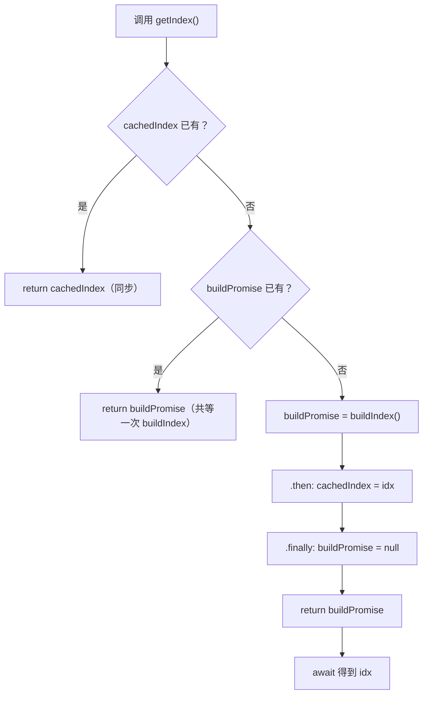

# RAG：`getIndex()` 流程（本地说明，不提交到 Git）

对应实现：`src/services/ragService.js` 中的 `getIndex` / `buildIndex`。

## 流程图

## `then` / `finally` 在做什么

- **`then`**：`buildIndex()` **成功**后把结果存进 `cachedIndex`，并把 `idx` 继续作为 Promise 的结果，供 `await getIndex()` 使用。
- **`finally`**：**无论成功或失败**都会执行，把 `buildPromise` 置回 `null`，表示本轮构建结束；失败时下次调用可以重新 `buildIndex()`。

在 Cursor / VS Code 中可安装 Mermaid 预览插件查看上图；或在 [Mermaid Live Editor](https://mermaid.live) 粘贴 `flowchart TD` 代码块内容。
